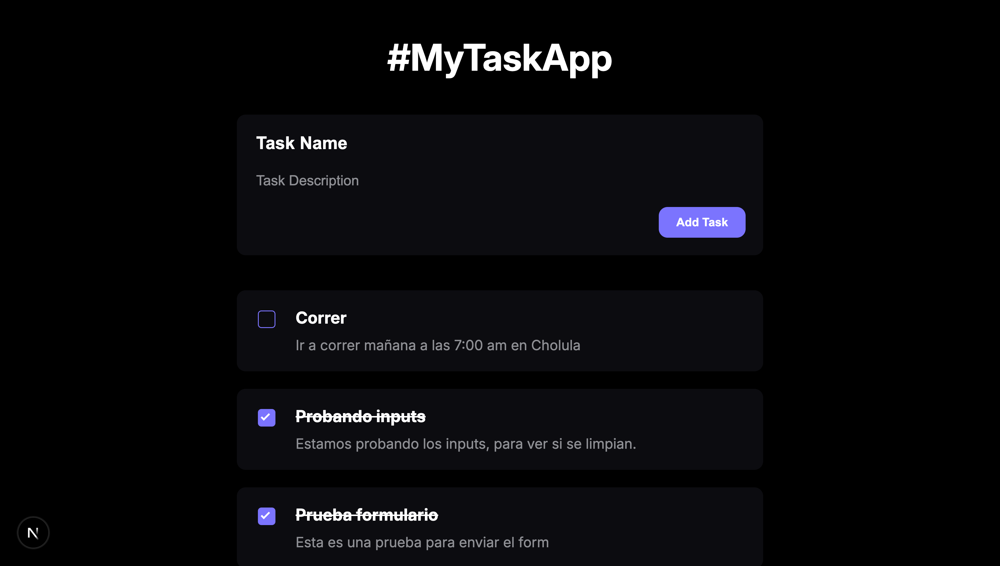

# Task App Django + Next.js

<div>
  <h3>
    <a href="https://taskapp.erikaax.dev">
      Demo
    </a>
    <span> | </span>
    <a href="https://github.com/ErikaAX08/task-app-django-next">
      Solution
    </a>
  </h3>
</div>

This is a task management project that combines Django on the backend and Next.js on the frontend, implementing Clean Architecture to maintain a clear separation of responsibilities and facilitate code scalability and maintainability.

## Overview



## Features

- **Backend**: Developed with Django, providing a RESTful API for task management.
- **Frontend**: Built with Next.js, offering an interactive and dynamic user interface for task management.
- **Clean Architecture**: Implementation of Clean Architecture principles for a clear separation of responsibilities.

## Project Structure

The project is organized into two main directories:

- **backend/**: Contains the Django application source code, including configuration, models, views, and URLs.
- **frontend/**: Includes the Next.js application source code, with components, pages, and styles.

## Prerequisites

Ensure you have the following components installed on your system:

- Python 3.8 or higher
- Node.js 14 or higher
- npm or yarn
- A Python virtual environment (recommended)

## Installation and Setup

Follow these steps to set up and run the project locally:

### Backend (Django)

1. Navigate to the `backend` directory:

   ```bash
   cd backend
   ```

2. Create and activate a virtual environment:

   ```bash
   python -m venv env
   source env/bin/activate  # On Windows: env\Scripts\activate
   ```

3. Install the dependencies:

   ```bash
   pip install -r requirements.txt
   ```

4. Apply the database migrations:

   ```bash
   python manage.py migrate
   ```

5. Start the development server:

   ```bash
   python manage.py runserver
   ```

   The server will be available at `http://127.0.0.1:8000/`.

### Frontend (Next.js)

1. Navigate to the `frontend` directory:

   ```bash
   cd ../frontend
   ```

2. Install the dependencies using npm or yarn:

   ```bash
   npm install
   # or
   yarn install
   ```

3. Start the development server:

   ```bash
   npm run dev
   # or
   yarn dev
   ```

   The application will be available at `http://localhost:3000/`.

## Contributions

Contributions are welcome. Please follow these steps to contribute:

1. Fork the repository.
2. Create a new branch for your feature or fix: `git checkout -b branch-name`.
3. Make your changes and commit them with descriptive messages.
4. Push your changes to the remote repository: `git push origin branch-name`.
5. Open a Pull Request detailing your changes.

## Contact

- Website: [erikaax.dev](https://erikaax.dev)
- GitHub: [@ErikaAX08](https://github.com/ErikaAX08)
- Twitter: [@ErikaAX08](https://twitter.com/ErikaAX08)
- Fiverr: [erikaax08](https://fiverr.com/erikaax08)
- LinkedIn: [Erika AX](https://www.linkedin.com/in/erikaax/)
- Instagram: [@erikaax08](https://www.instagram.com/erikaax08/)